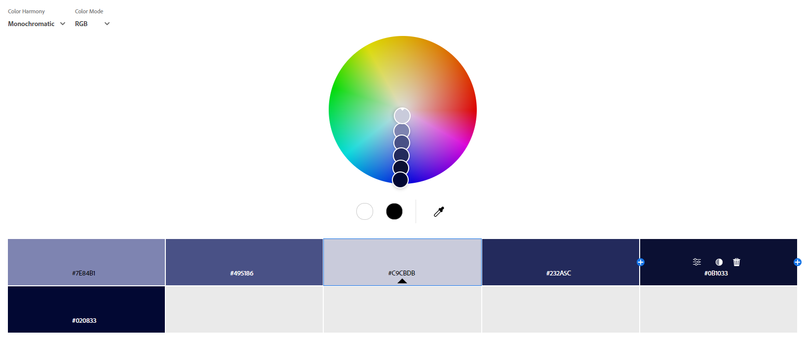

Assignment 1 - Hello World: Basic Deployment w/ Git, GitHub, Glitch
===

Aidan MacNevin
http://a1-aidanmacnevin.glitch.me

This is the first project of WebWare CS4241. It is the starting website for this term and served as a chance for us to use Git, GitHub, Glitch, and start developing using HTML/CSS/JS. 

## Technical Achievements
- **Styled page with CSS**: I created a styles.css file that contains styling information for multiple elements. See the file itself for additional details.
  - body: added background color
  - p: added text color and font 
  - h1, h2, summary: added text color, text size, and different font
  - details: spacing
  - li: text alignment, color, and font
  - footer: text size, color, and alignment
  - button: color, alignment, and bordering
  - video: display location
  
In the styles.css file, I styled 11 different elements. In addition, I experimented with a few different styling practices, such as keeping the video displayed in the center of the screen and using variables in the css file for different colors.

- **JavaScript Animation**: Video plays when a button is pressed. Disappears after playing. See test.js for details.

This is my first time connecting a JavaScript file to a website. I found this to be a fun challenge. I made the video player appear from being invisible, halved the volume, and close automatically when the video ends.

- **Other HTML Tags**: In addition to the tags originally contained in the file, I added a few new ones.
  - div
  - img
  - details
  - summary
  - footer
  - button
  - video

I had a few ideas for things I wanted on my website. To add these, I used some tags that I had not used before. Additionally, when I was doing the reading there were a few tags like the details and summary tags that I wanted to try using.  

## Design Achievements
- **Created and Used an Adobe Color Palette**: I created a color wheel using color.adobe.com and used the colors in my website. I used Monochromatic color harmony on the RGB color wheel. A screenshot is pictured below.
  - 

  It took me some time to find a color wheel that I liked and wanted to implement in my website. Initially I found it challenging to fit all the colors in to different elements of my website but once I found a set I liked it worked out well. Though, I may add different colors not from the color wheel in the future. 

- **Used the Lato and Montserrat Font from Google Fonts**: I used Lato as the font for the header text in my site and Montserrat for the general text. They were imported from Google fonts in the styles file.

This was my first time importing fonts from Google Fonts without outright downloading them. Unfortunately, the font that I was looking for was not available on Google Fonts.  

