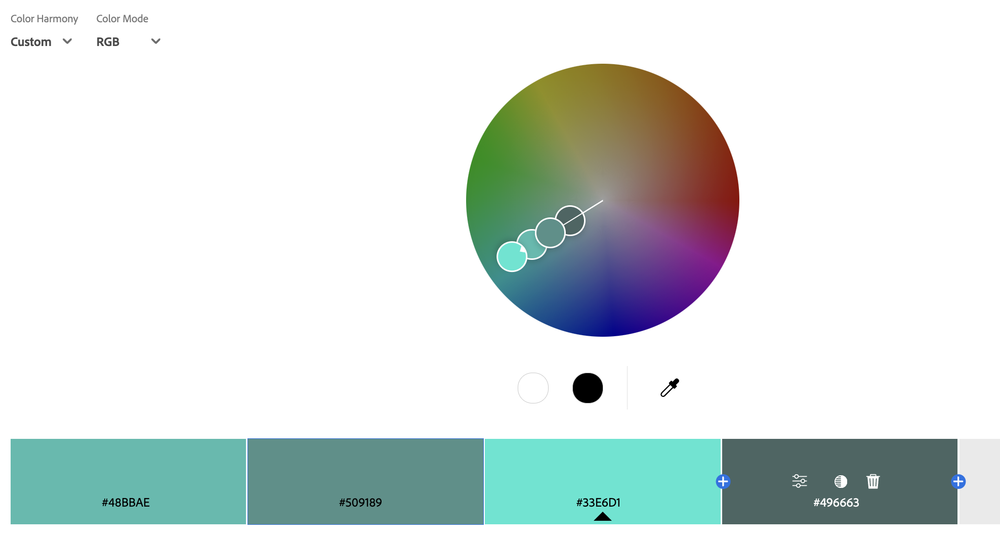

Hanzalah Qamar
http://a1-hanzalahqamar.glitch.me

This project shows:

## Technical Achievements
1. - **Styled page with CSS**:
*, *::before, *::after: Universal selector for box-sizing rule.
body, h1, p, ul, li: Reset default margins and paddings.
body: Sets the main typography and background color.
h1, h2: Style the header elements with a consistent font, text alignment, color, and background.
p: Style paragraphs with a bottom margin and specified color.
ul: Remove default list styling and center the list.
ul li: Style list items with background color, padding, margin, text color, and a left border.
ul li:nth-child(odd): Alternate the background color for odd list items.
@media (max-width: 768px): Media query to adjust styles for responsive design on smaller screens.

2. - **Included JavaScript Animation**
  animated the background color of the <body> element when the page loads using a script tag. It goes from a dark to a lighter color.
3. - **Included Semantic HTML tags**

    header: This tag is used to define the introductory content of the page, which often contains a group of introductory or navigational aids.

    nav: This tag is used to define a set of navigation links. Here, it's used to create a simple navigation menu at the top of the page.

    article: This tag specifies independent, self-contained content. It is used here to encapsulate the main content about Hanzalah Qamar.

    section: This tag defines a section in a document. It's used here to organize content by topics, such as "About Me" and "CS Classes".

    aside: This tag defines content aside from the content it is placed in (like a sidebar). Here, it's used to provide information about extracurricular activities.

    footer: This tag defines a footer for a document or section and contains information about the author of the document, copyright information, contact information, etc.

    address: This tag is used to provide contact information, which I included in the footer for an example of how to present this information semantically.

## Design Achievements
### Color Palette Implementation
I created a unique color palette using [Adobe Color](https://color.adobe.com). This palette was then implemented throughout my website to maintain a consistent and visually appealing design. Each color from the palette has been applied to various elements on the webpage to ensure that the overall design is cohesive. The palette is utilized in the following ways:

- **Background Color**: The lightest color in the palette is used as the background color for the entire webpage, providing a subtle, neutral backdrop that makes the content stand out.
- **Text Color**: The darkest color from the palette is used for the main body text, offering maximum contrast against the light background for readability.
- **Headers**: A vibrant color from the palette highlights the header elements, drawing attention to the page's main sections.
- **List Items**: Alternating colors from the palette are used for list item backgrounds to create a visually engaging pattern that also aids in content organization.

A small screenshot of the color wheel from my Adobe Color palette is included in the repository to demonstrate the color scheme visually.

- **Montserrat Font**: Imported via the Google Fonts API, this font is applied to the `h1` header element, adding a modern and clean aesthetic to the titles on the webpage. It was chosen for its geometric accuracy and contemporary character, which enhances the site's overall professional look.