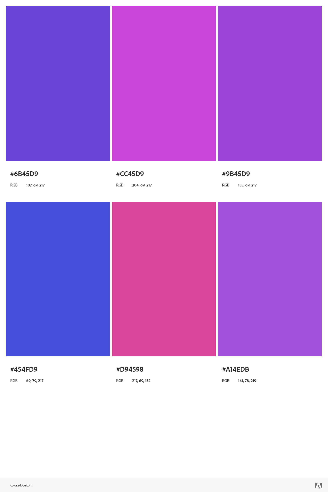

## Nat Dynko
https://a1-nathandynko.glitch.me/

This project shows ...

## Technical Achievements
- **Styled page with CSS**: To style my page, I used:
    * text-align: This allowed me to center all my text.
    * background-color: Sets the background color of different elements (used the color pallete found below).
    * display: This allowed certain elements to be placed as blocks on the page, so more could fit in the same line.
    * text-decoration-line: I used this tag to underline all of the text in my `<body>` tag.
    * list-style-position: I needed to add this so that the numbers and bullets on my page got centered with the rest of my text.
- **Javascript**: I used some inline javascript to load external gifs from another hosting website.
- **Additional HTML tags**: Some additional tags I used are:
    * marquee: Not a fan-favorite, but I love this tag. Its my favorite html tage.
    * script: Used this for small lines of javascript embedded in the html file
    * button: A simple button that links to somewhere else...
    * header: This tag defines the top of the page, where the scrolling text is.
    * iframe: This allows me to integrate another website into my own, which I did with a web tool I made during IQP.

## Design Achievements
- **Used the Ojuju Font from Google Fonts**: I used the Ojuju font for the text of my header.

- **Used this color pallete**

