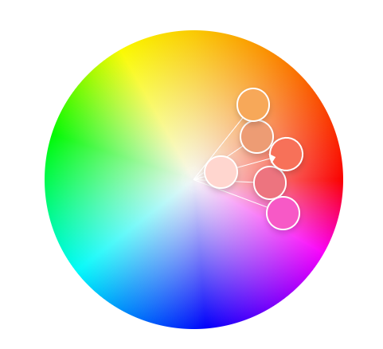

Carlos Medina
http://a1-carlosmedina.glitch.me

This project shows ...

## Technical Achievements

- **Styled page with CSS**: Added rules for the body, table, caption, thead, th, td, tbody (every other), figure, figcaption, custom classes, and footer

For the body, I made all children use the Roboto font

For the table, I made it have separators and colored them black, along with some width

For the table caption, I made it have me padding and made it under the table, along with making the font bold

For the table rows, I made every even row have a color, and every odd row have a different color

For figures, I made them have a light border, and gave them a caption

For the figure caption, I made the background a color and put it over the image

I made a selector on the figure and made it so that the cursor changed to a hand on hover

I also wrapped a div around the figures and made them flex

For the footer, I centered the text and added some coloring

- **Simple javascript animation**: I used javascript and some css to grow figures by 50% when they are clicked, and go back to normal when they are clicked again

- **Experiment with other semantic HTML tags**: Used the following semantic tags: table, img, caption, footer, figure, figcaption, main, and small

I have a link tag for CSS

I have a script tag for the animation

I have a main tag to denote the main content of the website

I have a table tag with multiple sub tags

- I have a thead for the header line
- I have a td for the data portion of the table
- I have a tr for a row grouping in the table

I have a figure for linking together and img and figcaption

I have an img for logos

I have a figcaption to show descriptions of the images

I have footer for footer content

I have a small tag for smaller text in the footer

## Design Achievements

- **Used the Roboto Font from Google Fonts**: I used Roboto as the font for the primary copy text in my site

- **Used custom color palette**: I used a five-color analogous color palette. I set these as variables in my CSS and used them throughout

