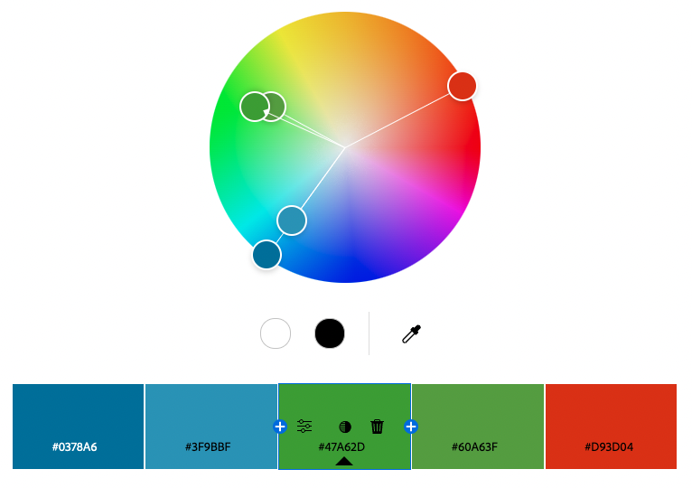

Gabriel Shiu

http://a1-gabrielshiu.glitch.me

This project introduces me and my background.

## Technical Achievements
- **Styled page with CSS**: Added rules like:
  - .panel: a background platform with contents
  - .green: a panel with a green border
  - .blue: a panel with a blue border
  - .orangeHighlight: an orange highlighted span
  - .greenHighlight: a green highlighted span
  - .blueHighlight: a blue highlighted span
  - header: a sticky top header
  - .content: a content section with padding against the headers
  - footer: a bottom sticky footer
  - .footerP: a paragraph in the footer
  - Various other rules for these selectors:
    - a
    - p
    - label
    - input
    - img
    - table
    - td
    - th
    - li
    - body
    - h1
    - h2
  - It took a lot of effort to design and style properly. I was pretty familiar with css before but I learned a lot about how to use it effectively and efficiently.
- **Animation**: The header, footer, and highlighted spans fade in when the page is loaded. This was new to me!
- **Other semantic elements**: Used `header`, `footer`, `form`, `table`, `img`, `link` to organize the page. I never used the header or footer tags before, it was good to learn them.

## Design Achievements
- Used a color palette from https://color.adobe.com/ I haven't used color palettes before, it was hard to think about how to incorporate the different colors.

- **Used the Poppins Font from Google Fonts**: I used Poppins as the font for the primary copy text in my site. https://fonts.google.com/specimen/Poppins I also haven't used fonts before.