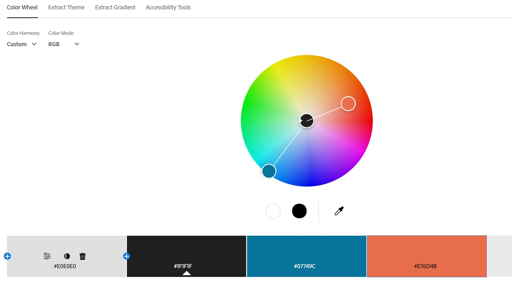

Assignment 1 - Hello World: Basic Deployment w/ Git, GitHub, Glitch
===

Jack Lafond
http://a1-joacklafond.glitch.me

This project shows that I understand the basic concepts of using html tags to organize a web page as well as how to use css to style different elements of an html page. By linking a css page I also show an undertsanding of how the server.js file works, and how to update it to be able to process new file requests. For this project I tried to create a clean design with some fun interactions, like on hover styling, and on click interactions.

## Technical Achievements
- **Styled page with CSS**: I added rules for most of the html elements in my index file including rules for h1, h2, p, ul, and li
- **Experimented with other semantic HTML tags**: I added other HTML tag elements to the file like link, script, footer, a, and span
- **Added Event Listener and Alert**: While it is not a javascript animation I did add an event listener for my email. On click the email is copied and then the copied text is attached to the users clipboard. The user is then alerted on their browser that the email was copied to their clipboard. While I have some experience with html and css, this was a good learning experience to start to understand how javascript can be used to make elements of a webpage reactive.

## Design Achievements
- **Created a Nice Color Palette From the Adobe Webpage**: I used the provided link to the adobe webpage to create a color palette which can be seen in the following screenshot:

- **Used the Poppins Font from Google Fonts**: I used Poppins as my font choice for my webpage. I looked through the fonts on google fonts and liked this one as it was clean and easy to read. I used the link html tag in order to import this google font into my web page.
