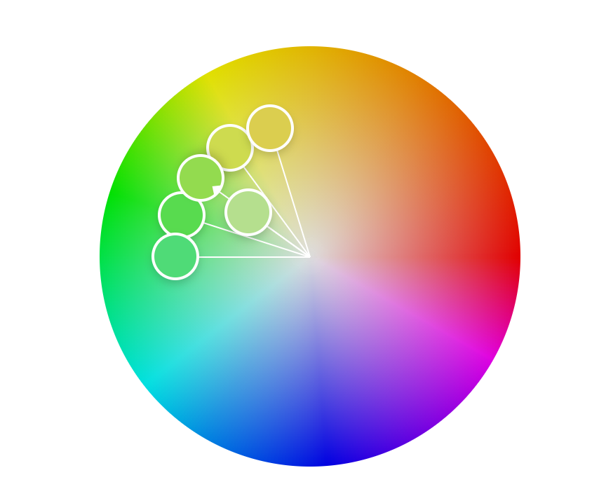
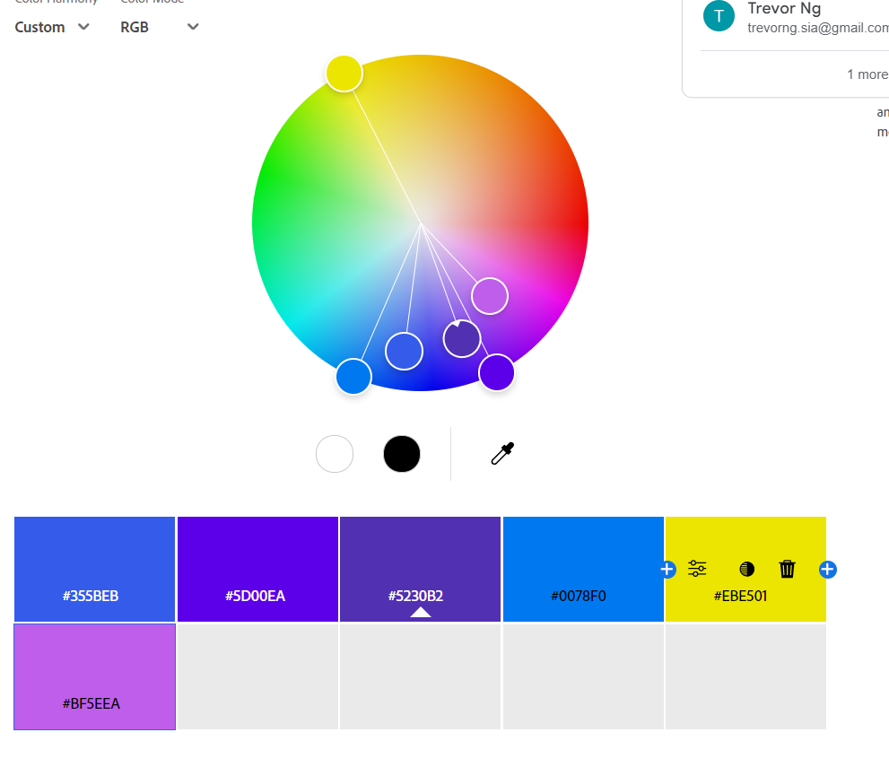

Andrew Salls

CS 4241 Assignment 1 (a1)

https://a1-andrewsalls.glitch.me

This project shows that I have too much free time and also ...

## Technical Achievements
- **Styled page with CSS**: Added rules for the p, h2, h4, li, and ul tags.

- **Incorporated animations into the website**: The sidebar contains buttons which use a brightness filter transition, the bonus happy face uses a 3d rotation style that is updated at a set interval in JavaScript, and the physics simulation uses canvas rendering updated via JavaScript.

- **Incorporated semantic HTML tags**: I used a nav tag for the sidebar, and used a header and footer inside of that. I also used tables, local links, and input labels.

(I was going to include a picture of a singular footer tag, but that was kind of silly)
## Design Achievements
- **Used a color palette from color.adobe.com**: I chose a complementary color palette because I thought it looked the least bad, but it still kind of looks bad. I mean, pretty much any combination of the colors in the palette don't pass their own accessibility test, and the colors are in their default position for the complementary color palette option.

I was going to use Coolors but unfortunately they added a bunch of restrictions to the free version since I last used it, to where it's nowhere near as good now.

- **Used the Inconsolata and Lusitana Fonts from Google Fonts**: The Inconsolata is the paragraph/general body font, and Lusitana is the heading font.

## Conclusion ##

In conclusion, just be glad I didn't add sound effects to the ball bouncing off walls or the face rotating.