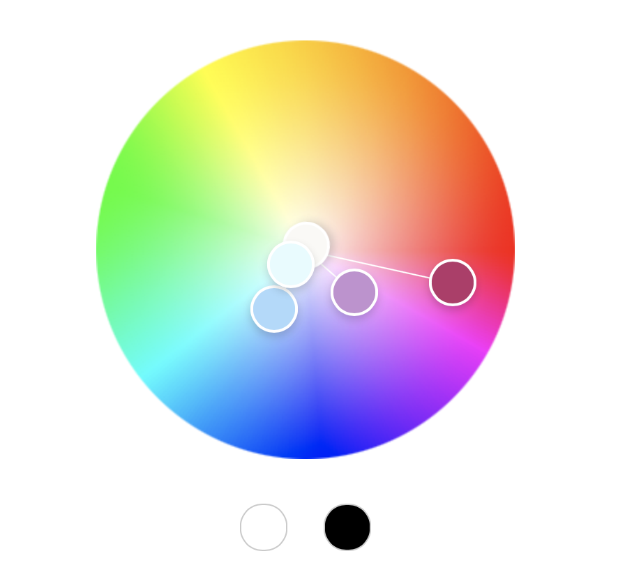

Joselin Barbosa
http://a1-joselinbarbosa.glitch.me

This project shows...

## Technical Achievements
- **Styled page with CSS**: Added rules to p, li, img, footer, header, and section to have these have certain color, padding, and to change text alignment.
- **Added a slideshow animation using Javascript**: I have two images flicker back and forth every second without the user having to manually click through them.
- **Used link, image, header, footer and section HTML tags**: I added a link to a project page I made for a different class. I added images using image tags. I added a header and a footer. I also separated the website into sections using the section tag to give my website more organization.
## Design Achievements
- **Created a color palette using color.adobe.com**: I created a color scheme on adobe and I used these 5 colors on my website for header background, image border, footer background, footer text, and background for sections. Below is a screenshot of the color palette.

- **Used the Shippori Antique B1 Font from Google Fonts**: I used Shippori Antique B1 as the font for the text on my website.
