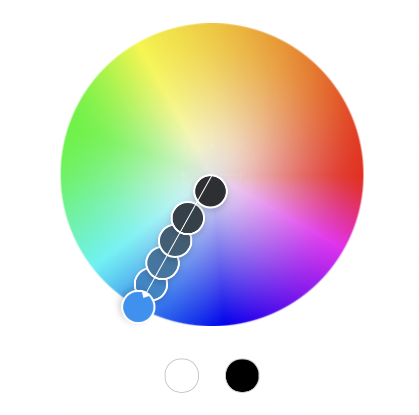

Joshua Cuneo http://a1-joshuacuneo.glitch.me

This project shows ...

Technical Achievements
Styled page with CSS: 
- I added different stylings for my page's background, paragraph and header colors from a monochromatic adobe color scheme.
- I used the Roboto font from Google Fonts, and modified the weight parameter to create contrast between my elements.
- I used the text-decoration CSS tag to underline text on my headers.
- I used the margin-left tag to modify the margins of my page. 
- I created a header and footer in HTML.
- I used the 
 tag to create a separate section for my <footer> tag.
Design Achievements
- Used the Roboto Font from Google Fonts: I used Roboto as the font for the primary copy text in my site.
- Used a monochromatic color theme from adobe color:
- 
